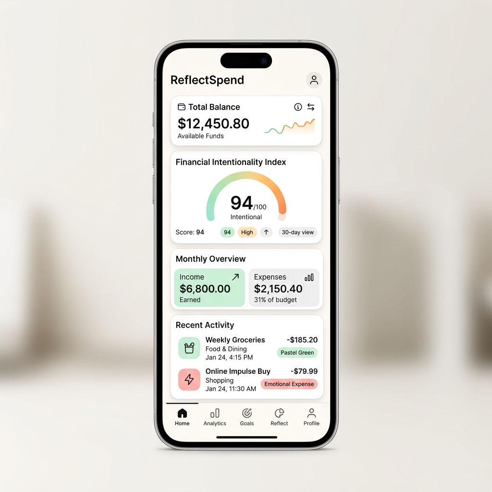
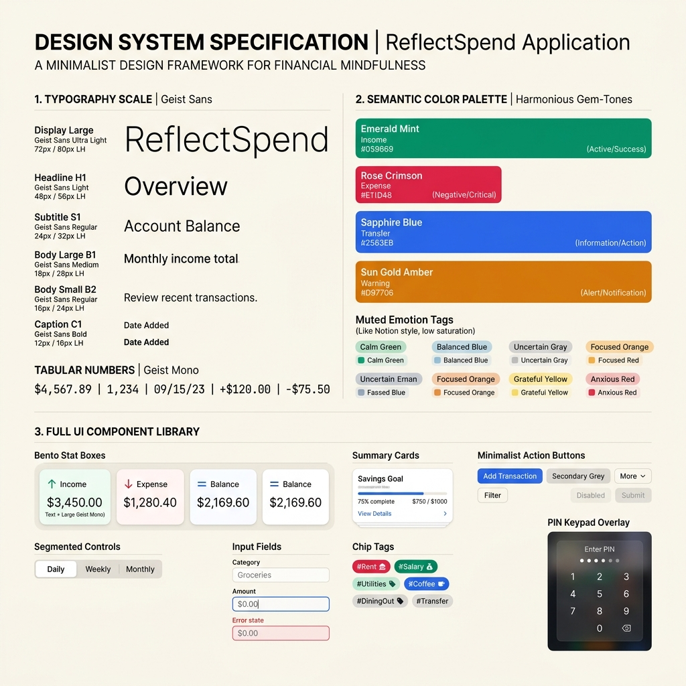

<div align="center">

  <h1>💳 ReflectSpend</h1>
  <p><strong>Pencatatan Keuangan Mindful & Analisis Pemicu Emosional Perilaku</strong></p>

  <p>
    <a href="https://iamdyjo.github.io/ReflectSpend/"></a>
    <a href="manifest.json"></a>
    <a href="docs/DESIGN_SYSTEM.md"></a>
    <a href="LICENSE"></a>
  </p>

  <p><em>"Aplikasi keuangan biasa mencatat <strong>apa</strong> yang kamu beli. ReflectSpend mencatat <strong>kenapa</strong> kamu membelinya."</em></p>

  <br />

  <a href="https://iamdyjo.github.io/ReflectSpend/">
    
  </a>

</div>

---

## 🌟 Mengapa ReflectSpend?

Sebagian besar masalah pengeluaran impulsif **bukan disebabkan oleh kurangnya data nominal**, melainkan **kurangnya kesadaran emosional (mindfulness)**. ReflectSpend hadir sebagai aplikasi *Local-First PWA* yang menghubungkan setiap Rupiah yang kamu belanjakan dengan kondisi emosional dan intensionalitas di baliknya.

---

## ✨ Fitur-Fitur Unggulan

### 🧠 Psikologi Perilaku & Analisis Intentionality
* 📈 **Skor Indeks Intentionality (0–100)**: Mengalkulasi kesehatan keputusan finansial secara *real-time* berdasarkan alokasi terencana vs impulsif serta beban emosi negatif.
* 💸 **Dana Impulsif (Impulsive Loss Amount)**: Menampilkan total nominal Rupiah yang terbuang untuk transaksi tidak direncanakan di Stat Grid Dashboard.
* 🧘 **Mindful Cooldown Interceptor**: Mengintersepsi transaksi impulsif nominal tinggi (> Rp 100.000) dengan pesan refleksi yang hangat dan *non-judgmental* sebelum menyimpan data.
* 📊 **Matriks Value-at-Risk Emosi**: Grafik distribusi total pengeluaran per spektrum emosi lengkap dengan persentase dan rekomendasi koping psikologi personal.

### 🛡️ Keamanan & Kedaulatan Data
* 🔒 **Full-Screen PIN Keypad Overlay Security**: Proteksi akses aplikasi dengan 4-angka PIN berbasis enkripsi hashing `SHA-256` via Web Crypto API (`crypto.subtle`) tanpa library eksternal.
* 💾 **1-Click Export CSV & JSON**: Pencadangan data mandiri ke file `.csv` atau `.json` lokal dalam 1 klik tanpa *vendor lock-in*.
* ☁️ **Hybrid Local-First + Google Sheets Cloud Sync**: Aplikasi bekerja 100% offline via Service Worker PWA, dan otomatis mensinkronkan data ke **Google Sheets** pribadi Anda via Web App API saat terhubung ke internet.

### 🎨 Design System & Estetika Antarmuka
* 🔤 **Geist Sans & Geist Mono**: Menggunakan font **Geist Sans** yang ramah & menenangkan (bebas kesan kaku/menekan) dan **Geist Mono** (`.rs-tabular-nums`) untuk seluruh digit angka agar sejajar vertikal.
* 💎 **Harmonious Gem-Tone Palette**: Warna semantik presisi — Emerald Mint (`#059669`), Rose Crimson (`#E11D48`), Sapphire Blue (`#2563EB`), dan Sun Gold Amber (`#D97706`).
* 🚫 **0 Raw Emoji**: Seluruh ikon menggunakan vektor SVG Lucide yang bersih & konsisten.

---

## 📐 Arsitektur Design System 3-Layer



ReflectSpend disusun menggunakan sistem **Design Tokens 3-Layer** yang didokumentasikan lengkap di **[docs/DESIGN_SYSTEM.md](docs/DESIGN_SYSTEM.md)**:

1. **Primitive Tokens**: Nilai mentah HSL/Hex warna netral hangat (`#FAFAFA` / `#18181B`), tag pastel Notion, serta font scale Geist.
2. **Semantic Tokens**: Alias visual untuk tema Terang vs Gelap, status keuangan (*Income*, *Expense*, *Transfer*, *Warning*), serta 6 warna emosi.
3. **Component Tokens**: Spesifikasi variabel khusus komponen (Summary Card, Bento Grid, Floating Action Button, Bottom Navigation Bar, Modal Sheet, Chip Badge, dan PIN Keypad).

---

## 🏗️ Struktur Repositori

```gfm
ReflectSpend/
├── index.html                  # Core Single Page App (PWA)
├── assets/
│   ├── design-tokens.css       # Production CSS Variable & Design Tokens
│   ├── reflectspend-ui-preview.png  # Preview Antarmuka UI Mobile
│   └── design-system-preview.png # Preview Board Design System
├── backend/
│   └── Code.gs                 # Google Apps Script Web App API (Google Sheets Sync)
├── database/                   # Master Data CSV Templates untuk Google Sheets
│   ├── 1_Transactions.csv
│   ├── 2_Weekly_Reflections.csv
│   ├── 3_Dashboard.csv
│   ├── 4_Categories.csv
│   ├── 5_Emotions.csv
│   ├── 6_Payment_Methods.csv
│   └── 7_Triggers.csv
├── docs/                       # Dokumentasi Lengkap
│   ├── DESIGN_SYSTEM.md        # Arsitektur Token 3-Layer & Spesifikasi UI
│   ├── GOOGLE_SHEETS_SETUP.md  # Panduan Setup Google Sheets API
│   └── GLIDE_AND_BACKEND_INTEGRATION.md # Panduan Deployment API & Glide
├── manifest.json               # Web App Manifest (PWA)
└── sw.js                       # Service Worker (Offline Support & Background Sync)
```

---

## 🚀 Cara Menjalankan Aplikasi (Quick Start)

### 🌐 Opsi 1: Buka Langsung Live Demo (100% Gratis)
👉 **[https://iamdyjo.github.io/ReflectSpend/](https://iamdyjo.github.io/ReflectSpend/)**

**Cara Pasang di HP (PWA):**
* **iPhone (Safari)**: Tap ikon **Share** → **Add to Home Screen**.
* **Android (Chrome)**: Tap titik tiga → **Install App** / **Add to Home Screen**.

---

### 💻 Opsi 2: Jalankan Lokal di Komputer
```bash
git clone https://github.com/iamdyjo/ReflectSpend.git
cd ReflectSpend
# Buka index.html di browser atau jalankan server lokal:
npx serve .
```

---

## 📜 Lisensi

Proyek ini dirilis di bawah lisensi **MIT License**.